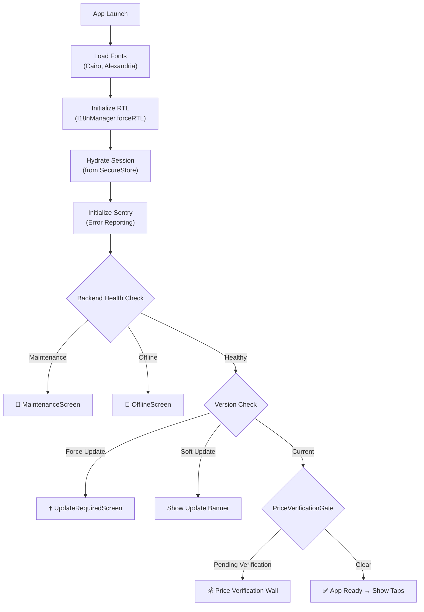
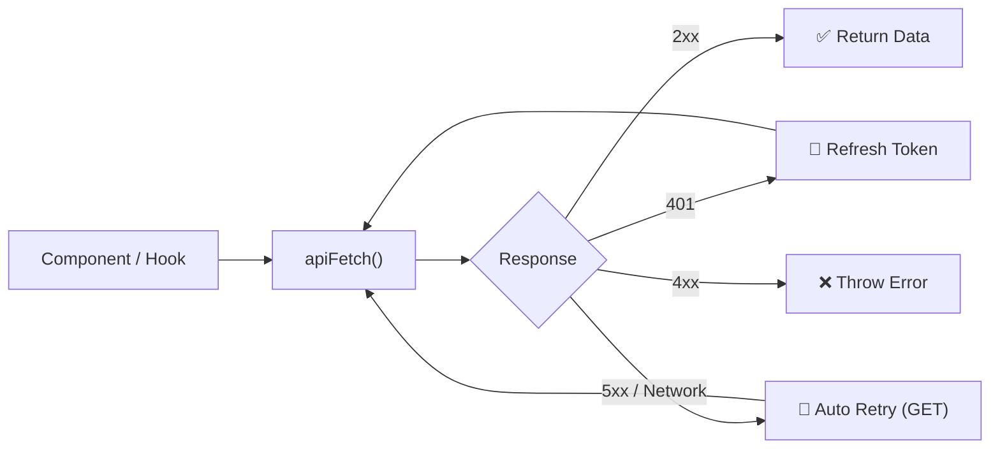

# 📱 Al Assema — Client Mobile App Documentation

> **Package**: `@alassema/mobile-client`
> **Platform**: React Native (Expo SDK 54 · Expo Router 6)
> **Target**: iOS & Android — Arabic-first, RTL layout
> **Purpose**: Customer-facing app for browsing service providers, submitting service requests, and real-time messaging

---

## Table of Contents

- [Overview](#overview)
- [Tech Stack](#tech-stack)
- [Project Structure](#project-structure)
- [Architecture](#architecture)
  - [Boot Sequence](#boot-sequence)
  - [App Shell & Navigation](#app-shell--navigation)
  - [Navigation Map](#navigation-map)
- [Screens](#screens)
  - [Main Tabs](#main-tabs)
  - [Company & Service Screens](#company--service-screens)
  - [Request Flow](#request-flow)
  - [Chat](#chat)
  - [Authentication Flow](#authentication-flow)
- [Components](#components)
  - [Domain Components](#domain-components)
  - [System / Error Boundary Components](#system--error-boundary-components)
  - [Primitives](#primitives)
- [State Management](#state-management)
- [API Integration](#api-integration)
  - [HTTP Client](#http-client)
  - [Authentication](#authentication)
  - [Live Events (SSE)](#live-events-sse)
  - [Client-Side Pricing Engine](#client-side-pricing-engine)
- [Theme & Styling](#theme--styling)
  - [RTL-First Design](#rtl-first-design)
  - [Color System](#color-system)
  - [Typography](#typography)
  - [Hermes Polyfill](#hermes-polyfill)
- [Build & Deployment](#build--deployment)
  - [Expo Configuration (`app.json`)](#expo-configuration-appjson)
  - [EAS Build Profiles (`eas.json`)](#eas-build-profiles-easjson)
  - [Over-the-Air Updates](#over-the-air-updates)
  - [Android Native Config](#android-native-config)
- [Environment Variables](#environment-variables)
- [Scripts & Tooling](#scripts--tooling)
- [Getting Started](#getting-started)

---

## Overview

The Al Assema client mobile app is the customer-facing side of the **العاصمة (Al Assema)** platform — a lead-generation service directory for Egypt's New Administrative Capital. Through the app, customers can:

1. **Browse** verified service providers (finishing, decoration, contracting, etc.)
2. **Search** across companies and services with full-text search
3. **Submit requests** via a multi-step wizard with live pricing estimates
4. **Chat** with providers in real-time after submitting a lead
5. **Track** request statuses and verify final pricing

The app is designed as an **Arabic-first** experience with strict RTL layout. It communicates with the Al Assema API backend (Next.js + Prisma + Supabase).

---

## Tech Stack

| Layer          | Technology                                                   |
| -------------- | ------------------------------------------------------------ |
| Framework      | React Native · Expo SDK 54                                   |
| Navigation     | Expo Router 6 (file-based routing)                           |
| Language       | TypeScript                                                   |
| Auth           | Email/Password · Google OAuth · Apple Sign In                |
| Token Storage  | `expo-secure-store` (hardware keychain)                      |
| Real-time      | Server-Sent Events (SSE)                                     |
| Captcha        | Cloudflare Turnstile (via WebView)                           |
| Error Tracking | Sentry                                                       |
| OTA Updates    | `expo-updates`                                               |
| Build          | EAS Build                                                    |
| Fonts          | Cairo (body) · Alexandria (headings) via `expo-font`         |
| Design Tokens  | Material 3 — 53-color token system from `@alassema/core`     |

---

## Project Structure

```
mobile/client/
├── app/                    # Expo Router screens (file-based routing)
│   ├── _layout.tsx         # Root layout — boot orchestration
│   ├── (tabs)/             # Tab-based screens
│   │   ├── index.tsx       # Home tab
│   │   ├── services.tsx    # Services/Search tab
│   │   ├── requests.tsx    # My Requests tab (auth-gated)
│   │   └── account.tsx     # Account tab
│   ├── company/[slug].tsx  # Company profile (dynamic route)
│   ├── companies/[slug].tsx# Companies by category
│   ├── services/[slug].tsx # Service detail
│   ├── search.tsx          # Full-text search
│   ├── new-request/[slug].tsx # Multi-step request wizard
│   ├── chat/[leadId].tsx   # Real-time chat
│   ├── sign-in.tsx         # Login
│   ├── forgot-password.tsx # Password reset request
│   ├── reset-password.tsx  # Password reset form
│   └── verify-email.tsx    # Email verification
│
├── components/             # Reusable UI components
│   ├── AppShell.tsx        # Custom shell wrapping tab navigator
│   ├── OfferingPicker.tsx  # Multi-level service selector
│   ├── PriceVerificationGate.tsx
│   ├── ReviewsMarquee.tsx
│   ├── CompanyGallery.tsx
│   ├── MediaLightbox.tsx
│   ├── Captcha.tsx         # Cloudflare Turnstile in WebView
│   ├── GuestPromptModal.tsx
│   ├── CrashScreen.tsx
│   ├── MaintenanceScreen.tsx
│   ├── OfflineScreen.tsx
│   ├── UpdateRequiredScreen.tsx
│   ├── Button.tsx          # Branded button primitive
│   ├── TextField.tsx       # Branded input primitive
│   ├── StatusPill.tsx      # Status badge
│   └── Icon.tsx            # RTL-aware icon wrapper
│
├── lib/                    # Business logic, hooks, utilities
│   ├── api.ts              # Centralized HTTP client (apiFetch)
│   ├── customerAuth.ts     # Auth state management
│   ├── liveEvents.ts       # SSE client with auto-reconnect
│   ├── pricing.ts          # Client-side pricing engine
│   ├── navShell.ts         # Navigation map (routes → tabs)
│   └── ...                 # Contexts, hooks, helpers
│
├── assets/                 # Images, icons, splash screens
├── scripts/                # Dev tooling scripts
│   └── sync-lan-ip.js      # Auto-patches .env with LAN IP
├── android/                # Android native config (Expo managed)
│
├── app.json                # Expo configuration
├── eas.json                # EAS Build profiles
├── babel.config.js         # Babel config
├── metro.config.js         # Metro bundler config
├── tsconfig.json           # TypeScript config
├── package.json            # Dependencies & scripts
├── index.ts                # Entry point (polyfills + registration)
├── .env.example            # Environment variable template
└── .gitignore
```

---

## Architecture

### Boot Sequence

The app follows a deliberate boot sequence orchestrated in [`_layout.tsx`](file:///f:/العاصمة/mobile/client/app/_layout.tsx):



> [!IMPORTANT]
> The `PriceVerificationGate` is a **blocking wall** — if the user has a completed request awaiting price confirmation, they cannot use the app until they verify or report a discrepancy.

### App Shell & Navigation

The app uses a custom [`AppShell`](file:///f:/العاصمة/mobile/client/components/AppShell.tsx) component that replaces the default Expo Router tab bar. This design decision solves a critical UX problem:

- **Problem**: Standard tab navigators hide the bottom tab bar when navigating to nested screens (e.g., a company profile from the home tab).
- **Solution**: The `TabBar` is rendered as a **sibling** to the navigation stack, ensuring it stays visible on all relevant screens while still hiding on full-screen routes (auth, onboarding).

### Navigation Map

[`navShell.ts`](file:///f:/العاصمة/mobile/client/lib/navShell.ts) defines a mapping from routes to 5 main tabs:

| Tab        | Icon      | Key Routes                                    |
| ---------- | --------- | --------------------------------------------- |
| 🏠 Home    | `home`    | Home feed, company profiles, service details  |
| 🔍 Search  | `search`  | Full-text search, companies by category       |
| 💬 Messages| `chat`    | Chat with providers (auth-gated)              |
| 📋 Requests| `list`    | My submitted requests (auth-gated)            |
| 👤 Account | `person`  | Profile, settings                             |

> [!NOTE]
> Deep linking is fully supported for auth flows (`/verify-email`, `/reset-password`), chat (`/chat/[leadId]`), and company profiles (`/company/[slug]`).

---

## Screens

### Main Tabs

| Screen      | Path                   | Description                                                                 |
| ----------- | ---------------------- | --------------------------------------------------------------------------- |
| **Home**    | `/(tabs)/`             | Landing page with featured companies, recent services, and review carousel  |
| **Services**| `/(tabs)/services`     | Browse services by category with filters                                    |
| **Requests**| `/(tabs)/requests`     | List of submitted leads/requests with status tracking. **Auth-gated** — guests see `GuestPromptModal` |
| **Account** | `/(tabs)/account`      | User profile, settings, logout                                             |

### Company & Service Screens

| Screen               | Path                     | Description                                                        |
| -------------------- | ------------------------ | ------------------------------------------------------------------ |
| **Company Profile**  | `/company/[slug]`        | Full company profile with gallery, reviews, projects, and CTA      |
| **Companies List**   | `/companies/[slug]`      | Companies filtered by service category                             |
| **Service Detail**   | `/services/[slug]`       | Detailed service page with providers offering this service         |
| **Search**           | `/search`                | Full-text search across companies and services                     |

### Request Flow

| Screen              | Path                     | Description                                                         |
| ------------------- | ------------------------ | ------------------------------------------------------------------- |
| **New Request**     | `/new-request/[slug]`    | Multi-step wizard for submitting a service request to a company     |

The request wizard includes:
1. **Offering Selection** — via the `OfferingPicker` component (multi-level service/tier/quantity selection)
2. **Live Price Estimation** — real-time total calculated by the client-side pricing engine
3. **Contact Details** — user info for the provider to follow up
4. **Captcha Verification** — Cloudflare Turnstile before submission
5. **Confirmation** — summary and submission

### Chat

| Screen  | Path              | Description                                                                    |
| ------- | ----------------- | ------------------------------------------------------------------------------ |
| **Chat**| `/chat/[leadId]`  | Real-time messaging between customer and provider, powered by SSE              |

### Authentication Flow

| Screen               | Path                 | Description                           |
| -------------------- | -------------------- | ------------------------------------- |
| **Sign In**          | `/sign-in`           | Email/password, Google, Apple login   |
| **Forgot Password**  | `/forgot-password`   | Request password reset email          |
| **Reset Password**   | `/reset-password`    | Set new password (from deep link)     |
| **Verify Email**     | `/verify-email`      | Email verification (from deep link)   |

---

## Components

### Domain Components

| Component                  | File                         | Purpose                                                                                           |
| -------------------------- | ---------------------------- | ------------------------------------------------------------------------------------------------- |
| **OfferingPicker**         | `OfferingPicker.tsx`         | Interactive multi-level selector for services, quantities, and tiers. Shows live price estimates based on complex pricing models and bundle discount rules. |
| **PriceVerificationGate**  | `PriceVerificationGate.tsx`  | Blocking wall that prevents app usage until the customer verifies the final price of a completed service or reports a discrepancy. |
| **ReviewsMarquee**         | `ReviewsMarquee.tsx`         | Animated horizontal scrolling showcase of user reviews.                                           |
| **CompanyGallery**         | `CompanyGallery.tsx`         | Gallery grid for company portfolio images and projects.                                           |
| **MediaLightbox**          | `MediaLightbox.tsx`          | Full-screen image/video viewer with zoom and swipe gestures.                                      |
| **Captcha**                | `Captcha.tsx`                | Cloudflare Turnstile challenge rendered safely inside a `WebView`.                                |
| **GuestPromptModal**       | `GuestPromptModal.tsx`       | Modal prompting unauthenticated users to sign in/register when accessing gated features.          |

### System / Error Boundary Components

| Component               | Purpose                                                              |
| ------------------------ | -------------------------------------------------------------------- |
| **CrashScreen**          | Graceful fallback UI for unhandled runtime exceptions                |
| **MaintenanceScreen**    | Displayed when backend health check returns maintenance mode         |
| **OfflineScreen**        | Shown when the device has no network connectivity                    |
| **UpdateRequiredScreen** | Forces app store update when a breaking version is detected          |

### Primitives

| Component      | Purpose                                                                  |
| -------------- | ------------------------------------------------------------------------ |
| **Button**     | Branded button with loading states, variants, and disabled styling       |
| **TextField**  | Branded text input with validation, error messages, and RTL support      |
| **StatusPill** | Color-coded badge showing request/lead status                            |
| **Icon**       | RTL-aware icon wrapper that automatically flips directional icons (arrows, chevrons) for Arabic users |

---

## State Management

> [!NOTE]
> The app **does not use** external state management libraries (no Redux, Zustand, MobX, etc.).

The state architecture relies on:

| Pattern                        | Used For                                          | Implementation                          |
| ------------------------------ | ------------------------------------------------- | --------------------------------------- |
| **React Context**              | Session, settings, user preferences               | `SessionContext`, `SettingsContext`      |
| **Custom Hooks**               | Data fetching, form state, UI logic                | Per-feature hooks in `lib/`             |
| **`useSyncExternalStore`**     | External reactive state (auth tokens)              | `lib/customerAuth.ts`                   |
| **Re-fetch on Focus**          | Stale data prevention                              | `useRefreshOnFocus` hook                |
| **Server-Sent Events (SSE)**   | Real-time updates (chat, lead status, maintenance) | `lib/liveEvents.ts`                     |

---

## API Integration

### HTTP Client

[`api.ts`](file:///f:/العاصمة/mobile/client/lib/api.ts) provides a centralized `apiFetch` wrapper with:

- **Automatic retries** for `5xx` and network errors on `GET` requests
- **JWT token injection** via `Authorization: Bearer <token>` header
- **Language header** (`Accept-Language: ar`) for Arabic responses
- **Automatic token refresh** on `401 Unauthorized` — transparently retries the original request with a new token



### Authentication

[`customerAuth.ts`](file:///f:/العاصمة/mobile/client/lib/customerAuth.ts) supports three authentication methods:

| Method              | Library                  | Notes                                            |
| ------------------- | ------------------------ | ------------------------------------------------ |
| **Email/Password**  | Direct API call          | Standard credentials flow                        |
| **Google OAuth**    | `expo-auth-session`      | OAuth 2.0 with Google client ID from env         |
| **Apple Sign In**   | `expo-apple-authentication` | **Mandatory for iOS** App Store compliance    |

**Token Storage**: Access and refresh tokens are persisted to the **hardware keychain** via `expo-secure-store`, ensuring they are encrypted at rest and not accessible to other apps.

### Live Events (SSE)

[`liveEvents.ts`](file:///f:/العاصمة/mobile/client/lib/liveEvents.ts) manages real-time data streaming:

- **Transport**: Server-Sent Events (SSE) over HTTP
- **Auto-reconnection**: Exponential backoff on connection loss
- **Event Types**:
  - New chat messages
  - Lead/request status changes
  - Platform maintenance announcements
  - Price verification prompts

### Client-Side Pricing Engine

[`pricing.ts`](file:///f:/العاصمة/mobile/client/lib/pricing.ts) mirrors the server-side pricing logic locally to provide **instant live total estimations** as users build their service baskets in the `OfferingPicker`. It handles:

- Per-item pricing with quantity multipliers
- Volume discounts and bundle rules
- Inspection fee calculations
- Tier-based pricing (Basic / Standard / Premium)

> [!WARNING]
> The client-side pricing is for **display purposes only**. The authoritative price is always calculated server-side on submission. The `PriceVerificationGate` ensures customers acknowledge the final server-calculated price.

---

## Theme & Styling

### RTL-First Design

The app is **Arabic-first** with strict RTL layout:
- `I18nManager.forceRTL(true)` is called during boot
- The `Icon` component automatically flips directional icons (arrows, chevrons)
- All layouts are designed for RTL reading order

### Color System

The app uses a **53-color Material 3 token system** imported from the shared `@alassema/core` monorepo package. This ensures visual consistency across the web and mobile platforms.

### Typography

| Font            | Usage                              | Loaded Via     |
| --------------- | ---------------------------------- | -------------- |
| **Cairo**       | Body text, paragraphs, form labels | `expo-font`    |
| **Alexandria**  | Headings, titles, prominent UI     | `expo-font`    |

Both fonts have excellent Arabic glyph support and are loaded asynchronously during the boot sequence.

### Hermes Polyfill

> [!CAUTION]
> The Hermes JavaScript engine (used by React Native) **lacks native `Intl.PluralRules` support**. Without a polyfill, Arabic pluralization rules crash the app immediately on launch.

A custom `Intl.PluralRules` polyfill is executed in [`index.ts`](file:///f:/العاصمة/mobile/client/index.ts) **before any other code runs**, including React Native registration.

---

## Build & Deployment

### Expo Configuration (`app.json`)

[`app.json`](file:///f:/العاصمة/mobile/client/app.json) defines:
- App metadata (name, slug, version, icons)
- iOS-specific config (bundle ID, associated domains for deep links)
- Android-specific config (package name, adaptive icons, predictive back gestures)
- Expo plugins configuration
- Deep linking URL schemes

### EAS Build Profiles (`eas.json`)

[`eas.json`](file:///f:/العاصمة/mobile/client/eas.json) defines three build profiles:

| Profile         | Purpose                                                     |
| --------------- | ----------------------------------------------------------- |
| **development** | Local dev builds with Expo Dev Client for debugging         |
| **preview**     | Internal testing builds (TestFlight / Internal Track)       |
| **production**  | Release builds for App Store / Google Play                  |

### Over-the-Air Updates

The app uses `expo-updates` for OTA (Over-the-Air) updates:
- **Non-native changes** (JS/TS code, assets) can be pushed without a store review
- The boot sequence checks for forced/soft updates and shows appropriate UI
- Critical fixes can be deployed instantly to all users

### Android Native Config

The Android directory follows the **Expo managed workflow**:
- Minimal manual Gradle modifications
- Relies on Expo config plugins for native integrations
- Adaptive icons configured in `app.json`
- Predictive back gestures enabled

---

## Environment Variables

All environment variables are defined in [`.env.example`](file:///f:/العاصمة/mobile/client/.env.example). Copy this file to `.env` and fill in the values:

```bash
cp .env.example .env
```

| Variable                           | Description                                           |
| ---------------------------------- | ----------------------------------------------------- |
| `EXPO_PUBLIC_API_URL`              | Backend API base URL                                  |
| `EXPO_PUBLIC_GOOGLE_CLIENT_ID`     | Google OAuth client ID for `expo-auth-session`        |
| `EXPO_PUBLIC_TURNSTILE_SITE_KEY`   | Cloudflare Turnstile site key for captcha             |
| `EXPO_PUBLIC_SENTRY_DSN`           | Sentry DSN for error reporting                        |

> [!TIP]
> For local development with a physical device, the `scripts/sync-lan-ip.js` script automatically patches `EXPO_PUBLIC_API_URL` with your machine's LAN IP on every `npm start`. No need to update `.env` manually when switching networks.

---

## Scripts & Tooling

### NPM Scripts

| Script        | Command                                    | Description                          |
| ------------- | ------------------------------------------ | ------------------------------------ |
| `start`       | Runs LAN sync + `expo start`              | Start Expo dev server                |
| `android`     | `expo run:android`                         | Run on Android device/emulator       |
| `ios`         | `expo run:ios`                             | Run on iOS simulator                 |
| `build:dev`   | `eas build --profile development`          | Create development build             |
| `build:preview`| `eas build --profile preview`             | Create preview/testing build         |
| `build:prod`  | `eas build --profile production`           | Create production release build      |

### Dev Scripts

#### `scripts/sync-lan-ip.js`

A pre-start utility that solves a common Expo Go pain point:

- **Problem**: Physical devices can't resolve `localhost` when pointing to the dev machine's API
- **Solution**: Automatically detects the dev machine's LAN IP address and patches `.env` with `EXPO_PUBLIC_API_URL=http://<LAN_IP>:3000`
- **Runs automatically** on every `npm start`

---

## Getting Started

### Prerequisites

- **Node.js** 22+
- **Expo CLI**: `npm install -g expo-cli`
- **EAS CLI**: `npm install -g eas-cli` (for building)
- **Expo Go** app on your phone (for development)
- Backend API running (see [`api/README.md`](file:///f:/العاصمة/api/README.md))

### Setup

```bash
# 1. Navigate to the client directory
cd mobile/client

# 2. Install dependencies
npm install

# 3. Create environment file
cp .env.example .env
# Edit .env with your API URL, Google Client ID, etc.

# 4. Start the dev server (auto-syncs LAN IP)
npm start

# 5. Scan the QR code with Expo Go on your phone
```

### Building for Release

```bash
# Preview build (internal testing)
eas build --profile preview --platform all

# Production build (store submission)
eas build --profile production --platform all

# OTA update (JS-only changes, no store review)
eas update --branch production
```

---

## Dependency on Monorepo

The client app imports shared code from `@alassema/core` (located in the monorepo root under `packages/`). This includes:

- **Design tokens** (53-color Material 3 system)
- **Shared types** (API response types, domain models)
- **Pricing logic** (mirrored in `lib/pricing.ts`)

The [`metro.config.js`](file:///f:/العاصمة/mobile/client/metro.config.js) and [`babel.config.js`](file:///f:/العاصمة/mobile/client/babel.config.js) are configured to resolve these monorepo dependencies correctly.

---

*Last updated: September 4, 2026*
